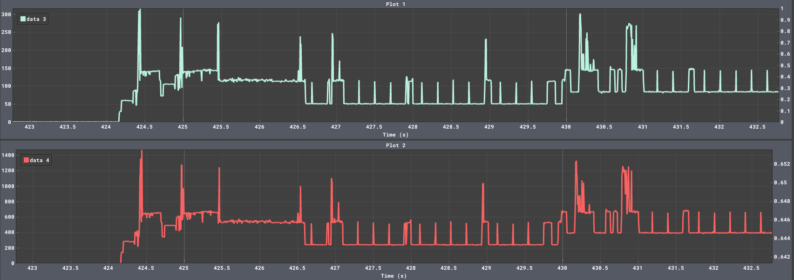

# Technical Details

This document provides the setup and general information about each request. For more detailed information, refer to the respective folders associated with each request.

---

### Hardware Used:
- **ESP32 WRoom Dev Kit**
- **Heltec WiFi LoRa (V3)**
- **2dB Antenna**
- **Breadboard**
- **Two Wires**
- **USB Multimeter**

### Software Setup:
- **Arduino IDE**
- **GPIO25** as DAC (Digital-to-Analog Converter)
- **GPIO7** as ADC (Analog-to-Digital Converter)

### Hardware Setup:
- The wave-generating device is connected to **GPIO25**, while the wave-sampling device is connected to **GPIO7**.
- A shared ground connection between the devices is established using a wire.

### Required Libraries:
- **ArduinoFFT**
- **paho-mqtt** - for the python server

---

## Requests & Solutions:

The device configuration used for the tests is the following:
**Device:** Heltec WiFi LoRa V3
**CPU Clock:** 240MHz
**ADC Resolution:** 10 bit
**ADC Attenuation:** 11db

---

### **1. Input Signal**
> Assume an input signal of the form:  
> `SUM(a_k * sin(f_k))`, where `a_k` and `f_k` represent the amplitude and frequency of the signal components, respectively.

The signal has been provided by generating a wave of the form <b>2sin(2π3t) + 4sin(2π5t)</b> using an ESP32 WRoom GPIO25 as a Digital-to-Analog Converter.

---

### **2. Maximum Sampling Frequency**
> Identify the maximum sampling frequency of your hardware device (e.g., 100Hz). This frequency should demonstrate the ability to sample at a high rate.

Letting the loop() function run without any delay, and measuring the average time for sampling the ADC has provided a maximum sampling frequency of 33.33kHz. The code has been tested with different ADC attenuation and resolution values (respectively between 0 and 11 Decibels, and between 9 and 12 bits), withouth observing any difference in the sampling rate. To avoid additional delays FreeRTOS has not been used. 

>**Max Sampling Frequency:** 33.33kHz

---

### **3. Optimal Sampling Frequency**
> Compute the Fast Fourier Transform (FFT) of the input signal and adapt the sampling frequency accordingly. For instance, if the maximum frequency in the signal is 5Hz, the sampling frequency should be adjusted to 10Hz.

The code simply performs an FFT on the sampled signal, and prints the peak frequency on the serial console. Initially the signal (<b>2sin(2π3t) + 4sin(2π5t)</b>, a sum of a 3Hz sin wave and a 5Hz wave) has been oversampled at 5kHz, and then the sampling frequency has been adjusted to 12Hz after performing an FFT, accordingly to the FFT major peak results.

---

### **4. Compute Aggregate Function over a Window**
> Compute the average of the sampled signal over a specified time window, such as 5 seconds.

Using FreeRTOS, two tasks have been defined. One stores the sampled values inside a circular buffer, the other computes the average.

---

### **5. Communicate the Aggregate Value to the Nearby Server**
> Transmit the aggregate value (e.g., the average) to a nearby edge server using **MQTT over Wi-Fi**.

The code is based on the previous Sliding Window Average implementation, with added WiFi and MQTT connectivity functionality. 
Functionality was tested by installing Termux on an Android device and subscribing to the same topic.

---

### **6. Communicate the Aggregate Value to the Cloud**
> Transmit the aggregate value (e.g., the average) to a cloud server using **LoRaWAN + The Things Network (TTN)**.

Following the example provided by Heltec in the [Heltec Repository](https://github.com/HelTecAutomation/Heltec_ESP32/blob/master/examples/LoRaWAN/LoRaWan/LoRaWan.ino), LoRaWAN connectivity has been integrated into the project.  

---

### **7. Measure the Performance of the System**
> 1. Evaluate the energy savings when using the adaptive sampling frequency compared to a fixed over-sampled approach.  
> 2. Measure the volume of data transmitted over the network when using the adaptive sampling frequency vs. the original over-sampled frequency.  
> 3. Measure the end-to-end latency of the system, from data generation to receiving the data at the edge server.

1. The power consumption was measured using a USB multimeter, which may introduce some inaccuracies. The ESP32 was powered at 5V, but actual power consumption could be affected by transmission resistance and the efficiency of the onboard voltage regulators (due to USB outputting 5V and the ESP32 operating voltage being optimal at **3.3V**, and not higher than 3.6V). These regulators introduce conversion losses, meaning the actual energy used by the microcontroller is lower than the supplied energy. From the measurements can be observed that the optimally sampled system consumes ~20% less power compared to the oversampled one.
Observerd values in a 5 minutes range:

    | Mode        | Power (W) | Current (A) | Charge (mAh) | Energy (mWh) |
    |-------------|-----------|-------------|--------------|--------------|
    | Oversampled | 0.23W    | 0.046A     | 48mAh        | 240mWh         |
    | Optimal     | 0.185W   | 0.037A     | 36mAh        | 192mWh         |

    The **charge** and **energy** values, are the expected values for one hour of usage.
    [Voltage Regulators Wikipedia page](https://en.wikipedia.org/wiki/Voltage_regulator)
    [ESP32 chip explanation, refer to **Section 5.2 Recommended Operating Conditions**](https://www.espressif.com/sites/default/files/documentation/esp32-s3_datasheet_en.pdf)

2. When using adaptive sampling versus over-sampling, the volume of data transmitted is reduced. For instance, if a message of 50 bytes is transmitted with MQTT over TCP (as in the provided code), the total data per transmission is approximately 96 bytes (50 bytes payload + 6 bytes MQTT overhead + 40 bytes TCP overhead). So if the transmission frequency is reduced from 10 Hz (over-sampling) to 5 Hz (adaptive sampling), the total data sent per second would drop from **960 bytes/second** to **480 bytes/second**, showing a 50% reduction in data volume.
More generically the volume of data transmitted is **96 bytes * Transmission_Frequency** bytes/seconds.
[Source for data and payload usage at docs.devicewise.com.](https://docs.devicewise.com/Content/Products/IoT_Portal_API_Reference_Guide/MQTT_Interface/MQTT-data-usage.htm)
3. The implemented system measures message latency by calculating the Round Trip Time (RTT) between a sender and a simple MQTT server (running on a personla computer) that echoes received messages. The estimated latency is half of the RTT. Over a typical home WiFi network, MQTT message latency is expected to range between 40 and 70 ms, with occasional peaks above or below this range due to network fluctuations, congestion, or processing delays on the broker or client side.

### Power Consumption Evaluation with INA219 Sensor

A better power consumption evaluation has been achieved by using the more suitable INA219 for this kind of scopes.  
The setup consists in using three different devices, as usual two ESP32 and an Arduino Uno R3. The scopes of the devices are the following:

- **Heltec LoRa V3**: Running the main program, possibly with adaptive sampling functionality, FFT computation (for the adaptive sampling) WiFi communication over the simple MQTT protocol, and also the more power hungry LoRa communication. It's the main device being monitored.
- **ESP32 Wroom Dev Kit**: It's only purpose is generating an input signal to be sampled by the Heltec ESP32, to be used for further purposes, and, very importantly, power the Heltec ESP32 acting as a power supply through the 5V pin directly wired to the microcontroller's USB power rail, ensuring that both the devices will be powered with enough current (from the connected computer).
- **Arduino Uno**: Through I2C communication (SCA and SCL pins), reads the INA219 needed values, like the shunt voltage, the current, and the power. An important thing to notice, is that due to the power being defined as \( P = V \times I \), and being the input voltage the 5V from the PC usb, the power consumption might look like reaching very high peaks, above 1000 mW.

#### Connection Overview

The connection of the various components has been setup as following:

- The ESP32 Wroom generating the signal is the power source.
- The Heltec ESP32 is the Load.
- The power wire connecting the two ESP32s (for powering the second ESP32 from the first), passes through the INA219 sensor.
- The two ESP32 have two wires connecting one the grounds, and the other the 5V Input pin.
- The Arduino device powers the INA219 through 5V and also communicates with it through I2C using the SCL and SDA pins.
- The Arduino ground was not shared with the ESP32s grounds.

#### Observation

An interesting observation arises when comparing current and power plots. Since power is defined as \( P = V \times I \), phenomena that involve small voltage variations, like ADC sampling the input pin (which reflects the sensed voltage), might be noticeable in the power graph but remain invisible in the current plot.

#### Results Overview

Overall way better values (more precise both temporally and numerically) have been obtained with the INA219 with respect to the USB multimeter. The multimeter outputs what looks like an off esteemed mean of the passing current.

The values obtained with the INA219 by observing the plots are the following:

| State                | Current (mA) | Power (mW) |
|-----------------------|--------------|------------|
| Light sleep           | ~1-3         | ~5-15      |
| Deep sleep            | ~0.1-0.5     | ~0.5-2.5   |
| Idle                  | ~40-50       | ~200-250   |
| Sampling              | ~50-90       | ~250-450   |
| FFT computation       | ~100-150     | ~500-750   |
| WiFi module on        | ~110-130     | ~550-650   |
| WiFi transmission     | ~150-250     | ~750-1250  |
| LoRa transmission     | ~120-230     | ~600-1150  |

The graph shows the power consumption (red, lower plot) and current draw (green, upper plot) of an ESP32 microcontroller across a ~10-second window. Up to second 424, the ESP32 is initializing and connecting to WiFi and MQTT, which is marked by a sharp rise in both current and power. After successful connection, between ~424s and ~430s, the device alternates between two main states: periodic sampling of analog input (flat baseline with small steps) and periodic bursts where FFT calculations are performed every 5 seconds (modest spikes in both plots). Sharp, high peaks at ~425s, ~427s, ~429s, and ~430s correspond to WiFi/MQTT activity — likely sending average values to the broker every 10 seconds. Finally, the ESP32 should prepare for deep sleep (not observable in the image), where current drawn drops significantly (values above).

---

### **8. Bonus**
> Consider at least three different input signals and measure the performance of the system. Discuss how different types of input signals might affect overall performance when using adaptive sampling compared to basic over-sampling.

Adaptive sampling significantly improves efficiency by reducing redundant data collection, lowering CPU load, and optimizing memory usage compared to oversampling, which wastes resources on unnecessary samples, especially for low-frequency signals. However, adaptive sampling may introduce FFT inaccuracies in cases of rapid signal transitions due to non-uniform sampling. While oversampling ensures precise signal reconstruction at the cost of increased power consumption and memory usage, adaptive sampling dynamically adjusts the rate to maintain efficiency, making it ideal for complex multi-signal scenarios. The trade-off between power consumption, accuracy, and computational overhead must be carefully considered, especially when using FreeRTOS, as task scheduling can introduce additional delays affecting real-time performance.

---
